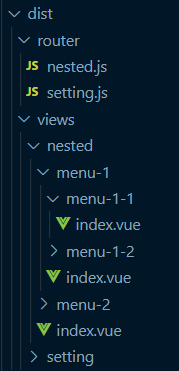
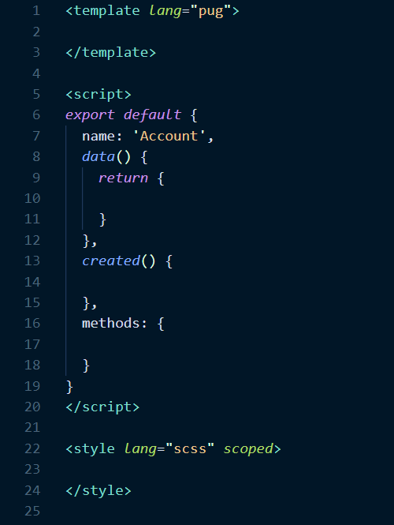
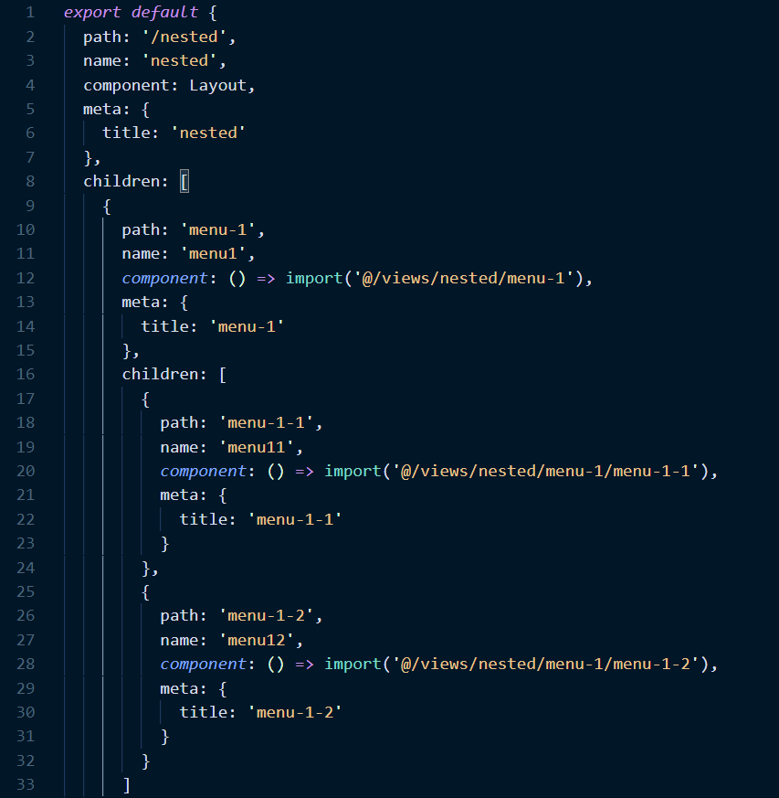

因为不想手动建文件了，所以花了几个小时写了个小玩具来偷点懒。

## Getting Started

`npm start`

## 功能说明

假设我的后台管理系统菜单长这样：

```
setting
  account
  others
nested
  menu-1
    menu-1-1
    menu-1-2
  menu-2
```

那我只需要按照这个结构写一份配置：

```js
const routes = [
  {
    key: 'setting',
    label: 'setting',
    children: [
      {
        key: 'account',
        label: 'account'
      },
      {
        key: 'others',
        label: 'others'
      }
    ]
  },
  {
    key: 'nested',
    label: 'nested',
    children: [
      {
        key: 'menu-1',
        label: 'menu-1',
        children: [
          {
            key: 'menu-1-1',
            label: 'menu-1-1'
          },
          {
            key: 'menu-1-2',
            label: 'menu-1-2'
          }
        ]
      },
      {
        key: 'menu-2',
        label: 'menu-2'
      }
    ]
  }
]
```

运行 `npm start` 就会生成如下的目录结构：



`.vue` 文件：



路由文件：




至于状态管理和 api，一般根据业务模块来分文件：

`const modules = ['setting', 'menu-1', 'menu-2']`

会相应生成：


目前只是个暂时满足了我的简单需求的小玩具，还有很多 bug，希望以后记得可以继续完善(感觉是个 flag)。